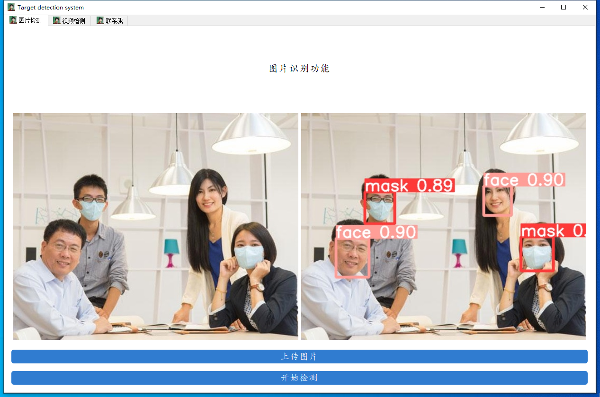

# susu-yolov5-notes

## 安装

### Windows10

1. 创建虚拟环境:

```shell
py -m venv env
```

2. 激活环境:

```shell
.\env\Scripts\activate
```

3. 确认 Python 解释器位置:

```shell
where python
```

4. Python 版本 (Python 3.8.1):

```shell
python --version
```

5. 安装 Pytorch (cpu):

```shell
pip install torch==1.9.1 torchvision==0.10.1 -i https://pypi.tuna.tsinghua.edu.cn/simple
python -m pip install --upgrade pip
```

6. pycocotools 的安装:

```shell
pip install pycocotools-windows
```

7. 其他包的安装:

```shell
pip install -r requirements.txt
pip install pyqt5
pip install labelme
```

8. 测试一下:

```shell
python detect.py --source data/images/bus.jpg --weights pretrained/yolov5s.pt
```


结果保存在 `runs\detect\exp\bus.jpg` :


### Linux (Ubuntu)

1. 配置 anaconda 的源来提高包的下载速度:

```shell
conda config --remove-key channels
conda config --add channels https://mirrors.ustc.edu.cn/anaconda/pkgs/main/
conda config --add channels https://mirrors.ustc.edu.cn/anaconda/pkgs/free/
conda config --add channels https://mirrors.bfsu.edu.cn/anaconda/cloud/pytorch/
conda config --set show_channel_urls yes
pip config set global.index-url https://mirrors.ustc.edu.cn/pypi/web/simple
```

2. 创建 python3.8 的虚拟环境:

```shell
conda create -n yolo5 python==3.8.5
conda activate yolo5
```

3. 安装 Pytorch:

```shell
conda install pytorch==1.8.0 torchvision
```

4. 安装 pycocotools:

```shell
pip install pycocotools
```

5. 其他包的安装:

```shell
pip install -r requirements.txt
pip install pyqt5
pip install labelme
```

6. 测试一下:

```shell
python detect.py --source data/images/bus.jpg --weights pretrained/yolov5s.pt
```


结果保存在 `runs\detect\exp\bus.jpg` :


## 数据处理 (Windows10)

1. 安装:

```shell
pip install labelimg -i https://mirror.baidu.com/pypi/simple
```

2. 启动:

```shell
labelimg
```

3. 软件启动后的界面如下:


### 数据标注

**标注的过程是：**

**1.打开图片目录**


**2.设置标注文件保存的目录并设置自动保存**


**3.开始标注，画框，标记目标的label，`crtl+s`保存，然后d切换到下一张继续标注，不断重复重复**


labelimg的快捷键如下，学会快捷键可以帮助你提高数据标注的效率。


标注完成之后你会得到一系列的txt文件，这里的txt文件就是目标检测的标注文件，其中txt文件和图片文件的名称是一一对应的，如下图所示：


打开具体的标注文件，你将会看到下面的内容，txt文件中每一行表示一个目标，以空格进行区分，分别表示目标的类别id，归一化处理之后的中心点x坐标、y坐标、目标框的w和h。


**4.修改数据集配置文件**

标记完成的数据请按照下面的格式进行放置，方便程序进行索引。

```bash
YOLO_Mask
└─ score
       ├─ images
       │    ├─ test # 下面放测试集图片
       │    ├─ train # 下面放训练集图片
       │    └─ val # 下面放验证集图片
       └─ labels
              ├─ test # 下面放测试集标签
              ├─ train # 下面放训练集标签
              ├─ val # 下面放验证集标签
```

这里的配置文件是为了方便我们后期训练使用，我们需要在data目录下创建一个`mask_data.yaml`的文件，如下图所示：


到这里，数据集处理部分基本完结撒花了，下面的内容将会是模型训练！

## 模型训练

### 模型的基本训练

1. 在 models 下建立一个 `mask_yolov5s.yaml` 的模型配置文件，内容如下：


2. 模型训练之前，请确保代码目录下有以下文件:


3. 执行下列代码运行程序即可：

```shell
python train.py --data mask_data.yaml --cfg mask_yolov5s.yaml --weights pretrained/yolov5s.pt --epoch 100 --batch-size 4 --device cpu
```

4. gpu 训练命令:

```shell
python train.py --data mask_data.yaml --cfg mask_yolov5s.yaml --weights pretrained/yolov5s.pt --epoch 100 --batch-size 32
```

5. 训练日志保存在 [01-32.txt](./results/shell/01-32.txt)，模型保存在 [exp8](./runs/train/exp8) .


## 模型使用

模型的使用全部集成在了 `detect.py` 目录下，你按照下面的指令指你要检测的内容即可:

```shell
 # 检测摄像头
 python detect.py  --weights runs/train/exp_yolov5s/weights/best.pt --source 0  # webcam
 # 检测图片文件
  python detect.py  --weights runs/train/exp_yolov5s/weights/best.pt --source file.jpg  # image 
 # 检测视频文件
   python detect.py --weights runs/train/exp_yolov5s/weights/best.pt --source file.mp4  # video
 # 检测一个目录下的文件
  python detect.py --weights runs/train/exp_yolov5s/weights/best.pt path/  # directory
 # 检测网络视频
  python detect.py --weights runs/train/exp_yolov5s/weights/best.pt 'https://youtu.be/NUsoVlDFqZg'  # YouTube video
 # 检测流媒体
  python detect.py --weights runs/train/exp_yolov5s/weights/best.pt 'rtsp://example.com/media.mp4'  # RTSP, RTMP, HTTP stream                            
```

比如以我们的口罩模型为例，如果我们执行 `python detect.py --weights runs/train/exp_yolov5s/weights/best.pt --source data/images/fishman.jpg` 的命令便可以得到这样的一张检测结果。


## 构建可视化界面

可视化界面的部分在`window.py`文件中，是通过pyqt5完成的界面设计，在启动界面前，你需要将模型替换成你训练好的模型，替换的位置在`window.py`的第60行，修改成你的模型地址即可，如果你有GPU的话，可以将device设置为0，表示使用第0行GPU，这样可以加快模型的识别速度嗷。


替换之后直接右键run即可启动图形化界面了，快去自己测试一下看看效果吧



## 官方命令

1. 按照官方给出的指令，这里的检测代码功能十分强大，是支持对多种图像和视频流进行检测的，具体的使用方法如下：

```shell
python detect.py --source 0  # webcam
              file.jpg  # image 
              file.mp4  # video
              path/  # directory
              path/*.jpg  # glob
              'https://youtu.be/NUsoVlDFqZg'  # YouTube video
              'rtsp://example.com/media.mp4'  # RTSP, RTMP, HTTP stream
```

## requirements files

### requirements files (Windows)

**Python 3.8.1**

Freezing dependencies:

```shell
pip freeze > win_requirements.txt
```

Using requirements files:

```shell
pip install -r win_requirements.txt
```

### requirements files (Linux)

**Python 3.8.5**

Freezing dependencies:

```shell
pip freeze > linux_requirements.txt
```

Using requirements files:

```shell
pip install -r linux_requirements.txt
```

## Reference

[1] [手把手教你使用YOLOV5训练自己的目标检测模型](https://www.bilibili.com/video/BV1YL4y1J7xz?p=1&vd_source=547d8a3d2ce70a88f0a699636396bd6f) .

[2] [yolov5-mask-42](https://gitee.com/song-laogou/yolov5-mask-42) .

[3] [手把手教你使用YOLOV5训练自己的目标检测模型-口罩检测-视频教程](https://blog.csdn.net/ECHOSON/article/details/121939535) .